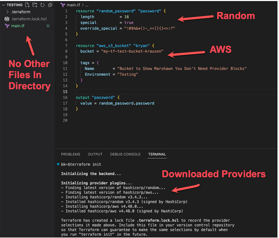

### Test Practice 4 ###

This is from Test 4 of the Udemy Course 
###### Earn your HashiCorp Certified: Terraform Associate 003 with over *300* unique Terraform Associate questions ######

#### these are all good details to ensure you know ####
#### the question is there verbatim ####
#### notes below each questions are facts and should be checked ####
#### only question missed are showing below ####

Review; make a branch and recommend any fixes (this should be perfect facts)

1. You need Terraform to destroy and recreate a single database server that was deployed with a bunch of other resources. You don't want to modify the Terraform code. What command can be used to accomplish this task?

- terraform apply -replace="aws_instance.database"

- When working with resources, there may be times where a particular resource didn't deploy correctly, although Terraform thinks it did. An example of this might be a script that runs on a virtual machine in the background. The virtual came up fine, so Terraform believes it was successful, but the script didn't perform the tasks you needed it to, so you need Terraform to destroy and recreate the one resource. In this case, you can use terraform apply -replace="<resource_id>"  to have Terraform replace this one resource on the next terraform apply. 

- This command was formally terraform taint, and you may or may not see terraform taint still on the exam. The taint command was deprecated in Terraform 0.15.2 and replaced with the terraform apply -replace command. Note that the resource is NOT immediately replaced when you run a terraform taint. It will only happen on the next terraform plan/apply. While HashiCorp does a great job updating their exams, sometimes commands can be a little slow to be removed or replaced from the test questions.

https://developer.hashicorp.com/terraform/cli/commands/taint

5. You are working on updating your infrastructure managed by Terraform. Before lunch, you update your configuration file and run a terraform plan to validate the changes. While you are away, a colleague manually updates a tag on a managed resource directly in the console (UI).   What will happen when you run a terraform apply?

- Before applying the new configuration, Terraform will refresh the state and recognize the manual change. It will update the resource based on the desired state as configured in the Terraform configuration. The manual change will no longer exist.

- There's a lot to this question, but the reasoning is pretty basic. Since a resource was manually changed, it means that Terraform state is no longer accurate. However, before a terraform plan or terraform apply is executed, Terraform refreshes its state to ensure it knows the status of all its managed resources. During this process, Terraform would recognize the change, update state, and compare that to the new configuration file. Assuming the change defined in the configuration is identical to the manual change, Terraform would simply apply any changes (if any), update the state file, and complete the terraform apply.

8. Your co-worker has decided to migrate Terraform state to a remote backend. They configure Terraform with the backend configuration, including the type, location, and credentials. However, you want to secure this configuration better. Rather than storing them in plaintext, where should you store the credentials for the remote backend? 

    1. credentials file
    2. environment variables 

- Some backends allow providing access credentials directly as part of the configuration for use in unusual situations, for pragmatic reasons. 
- In normal use, HashiCorp does not recommend including access credentials as part of the backend configuration. 
- Instead, leave those arguments completely unset and provide credentials via the credentials files or environment variables that are conventional for the target system, as described in the documentation for each backend.

https://developer.hashicorp.com/terraform/language/settings/backends/configuration

13. You have an existing resource in your public cloud that was deployed manually, but you want the ability to reference different attributes of that resource throughout your configuration without hardcoding any values. How can you accomplish this?

- Add a data block to your configuration to query the existing resource. Use the available exported attributes of that resource type as needed throughout your configuration to get the values you need.

- Anytime you need to reference a resource that is NOT part of your Terraform configuration, you need to query that resource using a data block - assuming a data source is available for that resource_type. Once you add the data block to your configuration, you will be able to export attributes from that data block using interpolation like any other resource in Terraform. For example, if you had an AWS S3 bucket, you could get information using a data block that looked like this:

<pre>
    data "aws_s3_bucket" "data_bucket" {
      bucket = "my-data-lookup-bucket-btk"
    }
</pre>

- Once you add the data block, you can refer to exported attributes like this: data.aws_s3_bucket.data_bucket.arn 

14. Your organization uses IaC to provision and manage resources in a public cloud platform. A new employee has developed changes to existing code and wants to push it into production.   What best practice should the new employee follow to submit the new code?

- Correct Answer: Submit a merge/pull request of the proposed changes. Have a team member validate the changes and approve the request.
- Have to watch for trick questions or just questions about "best practices" 
- Following best practices for code, the new changes should be submitted as a pull/merge request in the existing code repository. A teammate, or the security team, should validate the changes and approve the request, ultimately merging the new changes into the existing codebase

17. What CLI commands will completely tear down and delete all resources that Terraform is currently managing?

     1- terraform destroy  
     2- terraform apply -destroy 

- The terraform destroy command is a convenient way to destroy all remote objects managed by a particular Terraform configuration.

- While you will typically not want to destroy long-lived objects in a production environment, Terraform is sometimes used to manage ephemeral infrastructure for development purposes, in which case you can use terraform destroy to conveniently clean up all of those temporary objects once you are finished with your work.

- This command is just a convenience alias for the following command:
<pre>
- terraform apply -destroy</pre>

- For that reason, this command accepts most of the options that terraform apply accepts, although it does not accept a plan file argument and forces the selection of the "destroy" planning mode.

https://developer.hashicorp.com/terraform/cli/commands/destroy

19. DYNAMIC BLOCK produces nested configuration blocks instead of a complex typed value
- A dynamic block acts much like a for expression, but produces nested blocks instead of a complex typed value. 
- It iterates over a given complex value and generates a nested block for each element of that complex value. 
- You can dynamically construct repeatable nested blocks like setting using a special dynamic block type, which is supported inside resource, data, provider, and provisioner blocks.  

OTHER BLOCKS:
- RESOURCE BLOCK declares a resource of a given type with a given local name 
- DATA BLOCK requests that Terraform read from a given data source and export the result under the given local name 
- OUTPUT BLOCK exports a value exported by a module or configuration 

https://developer.hashicorp.com/terraform/language/expressions/dynamic-blocks

20. You need to use multiple resources from different providers in Terraform to accomplish a task. Which of the following can be used to configure the settings for each of the providers?

<pre>
    provider "consul" {
      address = "https://consul.krausen.com:8500"  
      namespace = "developer"
      token = "45a3bd52-07c7-47a4-52fd-0745e0cfe967"
    }
     
    provider "vault" {
      address = "https://vault.krausen.com:8200"
      namespace = "developer"
    }
</pre>

- To configure each provider, you need to define a provider block and provide the configuration within that block. You would need to do this for each provider that you need to configure. For example, if you needed to customize the aws, gcp, and vault provider, you'd need to create three separate provider blocks, one for each provider.

- Additional Clarity: While you can configure parameters inside a provider block, the provider block is not needed to use Terraform successfully. The most common configurations within a provider block are credentials to access the platform, which should be placed in environment variables rather than inside a provider block. In my examples above, I am providing custom configurations for my needs. But, if I were using the defaults, I wouldn't need to add a provider block for my project to be successfully deployed.

- Don't forget that configurations for a provider go inside of a provider block, but any provider constraints go inside of the terraform --> required_providers block.

https://developer.hashicorp.com/terraform/language/providers

https://developer.hashicorp.com/terraform/language/providers/configuration#provider-configuration-1

24. After using Terraform locally to deploy cloud resources, you have decided to move your state file to an Amazon S3 remote backend. You configure Terraform with the proper configuration as shown below. What command should be run in order to complete the state migration while copying the existing state to the new backend?

<pre>
    terraform {
      backend "s3" {
        bucket = "tf-bucket"
        key = "terraform/krausen/"
        region = "us-east-1"
      }
    }
</pre>
- terraform init -migrate-state
- Whenever a configuration's backend changes, you must run terraform init again to validate and configure the backend before you can perform any plans, applies, or state operations. Re-running init with an already-initialized backend will update the working directory to use the new backend settings. Either -reconfigure or -migrate-state must be supplied to update the backend configuration.
- When changing backends, Terraform will give you the option to migrate your state to the new backend. This lets you adopt backends without losing any existing state.

https://developer.hashicorp.com/terraform/language/settings/backends/configuration

https://developer.hashicorp.com/terraform/cli/commands/init#backend-initialization

26. Which of the following is not true about the terraform.tfstate file used by Terraform?
- it always matches the infrastructure deployed with Terraform
- The one thing that cannot be guaranteed is that the terraform.tfstate file ALWAYS matches the deployed infrastructure since changes can easily be made outside of Terraform. - For example, if you deploy a bunch of resources in GCP and nobody makes any changes, then yes, the terraform.tfstate file does match the current state of those resources. However, if an engineer makes a change in the GCP console or CLI, then the terraform.tfstate would NOT match the infrastructure deployed until you ran a terraform apply -refresh-only command.
- This is why the only false statement in this question is: it always matches the infrastructure deployed with Terraform.
- Terraform uses the terraform.tfstate file to store everything it needs to manage the resources it is managing. This includes a ton of information about each resource it provisions and manages. Because of this, HashiCorp recommends that you DO NOT modify the file directly outside of using the Terraform workflow (terraform init, plan, apply, destroy) and terraform state CLI commands.
- Many times, you'll need to provide sensitive values to deploy and manage resources, or Terraform may retrieve sensitive values at your request (like data blocks). In that case, these values may get saved to the state file, therefore you should limit who can access the state file to protect this sensitive data.

https://developer.hashicorp.com/terraform/language/state

https://developer.hashicorp.com/terraform/language/state/sensitive-data

https://developer.hashicorp.com/terraform/language/state/purpose

31. You are using Terraform OSS and need to spin up a copy of your GCP environment in a second region to test some new features. You create a new workspace. Which of the following is true about this new workspace? (select four)

    1. it uses the same Terraform code in the current directory
    2. changes to this workspace won't impact other workspaces
    3. it has its own state file
    4. you can use a different variables file for this workspace if needed

- Terraform workspaces (OSS) allow you to create a new workspace to execute the same Terraform but with a different state file. This feature will enable you to run the same Terraform with different configurations without modifying Terraform code or impacting any existing workspaces.  Terraform states out with the default workspace, and that's the workspace you are using unless you create and switch to a new workspace.

- Remember that Terraform Cloud and Enterprise also have Workspaces, but they behave slightly differently. In Cloud and Ent, each workspace is still isolated from others, meaning it has its own state. Still, often these workspaces point to different code repositories and use completely different Terraform configuration files.

To create a new workspace, you'd run:

    $ terraform workspace new btk
     
    Created and switched to workspace "btk"! 
     
    You're now on a new, empty workspace. Workspaces isolate their state, so if you run "terraform plan" Terraform will not see any existing state for this configuration.

To list all of the existing workspaces, you can run (note the * indicates the workspace you are using):

    $ terraform workspace list 
     
    default*
    btk
    bryan-dev
    temp-workspace

When using workspaces, you're essentially using the same Terraform configuration files. Therefore the backend will remain the same for all of your workspaces. That makes this answer incorrect.

https://developer.hashicorp.com/terraform/language/state/workspaces

https://developer.hashicorp.com/terraform/cli/commands/workspace/list

https://developer.hashicorp.com/terraform/cli/commands/workspace/new

32. You have a module named prod_subnet that outputs the subnet_id of the subnet created by the module. How would you reference the subnet ID when using it for an input of another module?
- subnet = module.prod_subnet.subnet_id 

- Using interpolation, you can reference the output of an exported value by using the following syntax: module.<module name>.<output name>

- Don't forget that before you can reference data/values from a module, the module has to have an output declared that references the desired value(s).

- No answers are valid interpolation syntax to reference an output that originates from a module.

https://developer.hashicorp.com/terraform/language/modules/syntax#accessing-module-output-values

https://learn.hashicorp.com/collections/terraform/modules

34. Which common action does not cause Terraform to refresh its state?
- terraform state list
- Running a terraform state list does not cause Terraform to refresh its state. This command simply reads the state file but it will not modify it.
- When running a plan, apply, or destroy, Terraform needs to refresh state to ensure that it has the latest information about the managed resources so it understands what changes should be made when applying the desired state configuration.

https://developer.hashicorp.com/terraform/cli/commands/init

35. You are using Terraform Cloud to manage a new data analytics environment for your organization. You have decided to use Sentinel to enforce standardization and security controls. At what step are the Sentinel policies enforced during a run?

- after the plan, run tasks, cost estimation phases but before the apply phase
Sentinel policy evaluations occur after Terraform completes the plan and after both run tasks and cost estimation. This order lets you write Sentinel policies to restrict costs based on the data in the cost estimates.

- OPA policy evaluations are slightly different and occur after Terraform completes the plan and after any run tasks. Unlike Sentinel policies, Terraform Cloud evaluates OPA policies immediately before cost estimation.

https://developer.hashicorp.com/terraform/cloud-docs/policy-enforcement/policy-results

36. Which of the following tasks does terraform init perform? (select three)
    1. prepares the working directory for use with Terraform
    2. caches the source code locally for referenced modules
    3. downloads required providers used in your configuration file

- The terraform init command performs several different initialization steps in order to prepare the current working directory for use with Terraform. Some of these steps include downloading any referenced providers (like AWS, Azure, GCP, etc.), caching the source code for modules in the local directory so they can be used, and other steps to prepare the working directory to be used with Terraform.

- Note that there are quite a few options that you can use with terraform init to perform operations that you might need when using Terraform. These operations might include state migrations or upgrading providers.
- The terraform init does NOT create a sample Terraform configuration file. Actually, I don't know if there are any native Terraform commands that will create a .tf file for you.

- You can run terraform init over and over again and it will not change/modify your state file.

https://developer.hashicorp.com/terraform/cli/commands/init

https://learn.hashicorp.com/collections/terraform/aws-get-started

37. You want to use a Terraform provisioner to execute a script on the remote machine. What block type would use to declare the provisioner?
<pre>
resource block
</pre>

38. True or False? Official Terraform providers and modules are owned and maintained by HashiCorp.
<pre>
True
</pre>

- This is true. If a module or provider is marked as official, it is owned and maintained by HashiCorp themselves. In fact, I copied the sentence in the question straight off the official Terraform registry page :)

- There are other modules/providers available in the registry that are maintained by third-party partners, or even individuals. This also means that not all of the modules published to the Terraform registry are validated or verified by HashiCorp. Many folks will use the public module registry as a starting place to create their own custom modules needed to meet requirements.

https://registry.terraform.io/

https://registry.terraform.io/browse/modules

https://developer.hashicorp.com/terraform/internals/module-registry-protocol

39. You are using Terraform to manage resources in Azure. Due to unique requirements, you need to specify the version of the Azure provider so it remains the same until newer versions are thoroughly tested.

What block would properly configure Terraform to ensure it always installs the same Azure provider version?
<pre>
    terraform {
      required_providers {
        azurerm = {
          source = "hashicorp/azurerm"
          version = "2.90.0"
        }
      }
    }
</pre>
- When you need to constrain the provider to a specific version, you would do this under the terraform configuration block. Within that block, you would use the required_providers block to set certain configurations, including the version of each provider you want to lockdown.

- Note that even though you would add the provider constraint under the terraform block, you may still indeed have a separate provider block to set certain configurations, like credentials, regions, or other settings specific to the provider. Just keep in mind that each distinct block is used for different settings.

https://developer.hashicorp.com/terraform/language/providers/requirements
https://developer.hashicorp.com/terraform/language/providers/requirements#version-constraints 

40. True or False? min, max, format, join, trim, and length are examples of different expressions in Terraform.
<pre>
False 
</pre>
- These are actually examples of Terraform functions, not expressions. Expressions would be something more in the line of string, number, bool, null, etc.
- For the exam, you should go through these and understand what they do at a high level as you could get questions on using a few of them. Check out the built-in functions for Terraform here - https://developer.hashicorp.com/terraform/language/functions

42. Which of the following are true regarding Terraform variables? (select two)
- the default value will be found in the state file if no other value was set for the variable
- variables marked as sensitive are still stored in the state file, even though the values are obfuscated from the CLI output

Explained 
- When it comes to working with variables, the value that is used in the Terraform configuration will be stored in the state file, regardless of whether the sensitive argument was set to true. However, the value will not be shown in the CLI output if the value was to be exported by an output block.
- Beyond the value, you won't find the variable name or description in the state file because they are simply used on the development side of Terraform, and not the backend operational aspect of how Terraform works.

https://developer.hashicorp.com/terraform/language/values/variables
https://learn.hashicorp.com/tutorials/terraform/outputs
https://learn.hashicorp.com/tutorials/terraform/variables

43. You are worried about unauthorized access to the Terraform state file since it might contain sensitive information. What are some ways you can protect the state file? (select two)
<pre>
- store in a remote backend that encrypts state at rest
- use the S3 backend using the encrypt option to ensure state is encrypted
</pre>
44. You have declared a variable named db_connection_string inside of the app module. However, when you run a terraform apply, you get the following error message:
<pre>
Error: Reference to undeclared input variable
    
on main.tf line 35:
4: db_path = var.db_connection_string
    
An input variable with the name "db_connection_string" has not been declared. This variable can be declared with a variable "db_connection_string" {} block.
</pre>
Why would you receive such an error?
- since the variable was declared within the module, it cannot be referenced outside of the module
- When using modules, it's common practice to declare variables outside of the module and pass the value(s) to the child module when it is called by the parent/root module. However, it's perfectly acceptable to declare a variable inside of a module if you needed. Any variables declared inside of a module are only directly referencable within that module. You can't directly reference that variable outside of the module. You can, however, create an output in the module to export any values that might be needed outside of the module.

46. Given the code snippet below, how would you refer to the value of ip for the dev environment if you are using a for_each argument?
<pre>
variable "env" {
    type = map(any)
    default = {
    prod = {
        ip = "10.0.150.0/24"
        az = "us-east-1a"
    }
    dev  = {
        ip = "10.0.250.0/24"
        az = "us-east-1e"
    }
    }
}
</pre>
- each.value.ip
- Sort of testing two different things here - a complex map variable plus the for_each argument.

- A for_each argument will iterate over a map or set of strings and create a similar instance/resource for each item in the map or set. In our case, the map is the input variable and the "each" would be the higher-level map, so prod and dev.  Underneath each value, there are two arguments, both az and ip that you can choose from.

- The input variable that is shown in this example is essentially a map of maps.

50. When using Terraform, where can you install providers from? (select four)
<pre>
official HashiCorp releases site
Terraform registry
plugins directory
Terraform plugin cache
</pre>

51. What Terraform command can be used to evaluate and experiment with expressions in your configuration?
<pre>
terraform console 
</pre>

55. True points the terraform.tfstate file used by Terraform?
<pre>
- does not always match the infrastructure deployed with Terraform
</pre>
- The terraform.tfstate file does not always match the infrastructure deployed with Terraform. It reflects the state of the infrastructure at the time of the last Terraform operation, so changes made outside of Terraform will not be reflected in the state file.

- It is recommended not to modify the terraform.tfstate file directly because it is managed by Terraform itself. Making manual changes to the state file can lead to inconsistencies and potential issues with the infrastructure management.

- The terraform.tfstate file can potentially contain sensitive values such as passwords, access keys, and other credentials. It is important to secure the state file to prevent unauthorized access to sensitive information.

- The terraform.tfstate file includes information about each resource managed by Terraform, such as resource IDs, attributes, dependencies, and metadata. This information is used by Terraform to track the state of the infrastructure and make decisions about resource creation, updates, and deletions.

- The one thing that cannot be guaranteed is that the terraform.tfstate file ALWAYS matches the deployed infrastructure since changes can easily be made outside of Terraform. For example, if you deploy a bunch of resources in GCP and nobody makes any changes, then yes, the terraform.tfstate file does match the current state of those resources. However, if an engineer makes a change in the GCP console or CLI, then the terraform.tfstate would NOT match the infrastructure deployed until you ran a terraform apply -refresh-only command

56. You are using Terraform Community and need to spin up a copy of your GCP environment in a second region to test some new features. You create a new workspace. Which of the following is true about this new workspace? (select four)

- it uses the same Terraform code in the current directory
- changes to this workspace won't impact other workspaces
- you can use a different variables file for this workspace if needed
- it has its own state file

57. You have declared a variable named db_connection_string inside of the app module. However, when you run a terraform apply, you get the following error message:
<pre>
Error: Reference to undeclared input variable
on main.tf line 35:
4: db_path = var.db_connection_string
</pre>    
- An input variable with the name "db_connection_string" has not been declared. This variable can be declared with a variable "db_connection_string" {} block.
- Why would you receive such an error? since the variable was declared within the module, it cannot be referenced outside of the module
- Variables declared within a module are scoped to that module and cannot be directly referenced outside of it. In this case, the variable "db_connection_string" was declared inside the "app" module, so it cannot be accessed outside of the module without proper scoping or passing it as an output.

55. When developing Terraform code, you must include a provider block for each unique provider so Terraform knows which ones you want to download and use.

- Unlike many other objects in the Terraform language, a provider block may be omitted if its contents would otherwise be empty. Terraform assumes an empty default configuration for any provider that is not explicitly configured. In other words, if you don't have any specific configurations for your provider, you may indeed leave it out of your configuration.

- To prove this out, I created a .tf file that includes a resource from the RANDOM provider as well as the AWS provider and omitted any provider blocks in my configuration. After running a terraform init, you can clearly see that Terraform understands what providers the resources are from and downloads the correct provider plugins. Thus proving that you do NOT need a Provider block to use Terraform.

https://developer.hashicorp.com/terraform/language/providers/configuration

###### BONUS ######  
00. How can you easily view the terraform state without catting or logging to pull down the remote 
- terraform state pull

